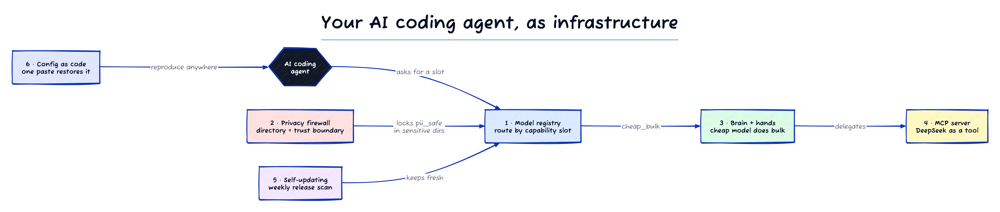

# Treat your AI coding agent like infrastructure



Reference code for a 6-part series (plus a bonus capstone) on running [Claude Code](https://claude.com/claude-code) (and agents like it) the way you'd run infrastructure: versioned, multi-vendor, cost-aware, and security-scoped.

This is a **reference implementation**, not a drop-in product. The snippets are intentionally small and self-contained so you can lift the idea, not clone a setup. It is a personal config pattern, not production infrastructure.

## The idea

An AI coding agent's config is volatile (models change monthly), multi-vendor (you mix providers for cost and capability), and security-sensitive (it can send your files to a third party). That is exactly the kind of thing we already know how to manage. Each part of the series applies one ordinary engineering discipline to the agent config.

| Part | Discipline | What's here |
|---|---|---|
| 1. [Capability-slot model registry](https://medium.com/p/4009afde1288) | abstraction | [`model-registry.example.yaml`](./model-registry.example.yaml) · [`resolve.mjs`](./resolve.mjs) |
| 2. [Directory-scoped privacy firewall](#read-the-series-on-medium) | security | [`privacy/`](./privacy/) |
| 3. [Brain and hands (cost routing)](#read-the-series-on-medium) | cost engineering | [`routing/brain-and-hands.md`](./routing/brain-and-hands.md) |
| 4. [Custom MCP server → DeepSeek](#read-the-series-on-medium) | integration | [`deepseek-mcp-server/`](./deepseek-mcp-server/) |
| 5. [A config that updates itself](#read-the-series-on-medium) | operations | [`.github/workflows/meta-update.example.yml`](./.github/workflows/meta-update.example.yml) |
| 6. [Config as code](#read-the-series-on-medium) | reproducibility | [`install.example.sh`](./install.example.sh) · [`RESTORE-PROMPT.md`](./RESTORE-PROMPT.md) |
| 7. [Tool-bridge (capstone)](#read-the-series-on-medium) | trust boundary | [`routing/tool-bridge.md`](./routing/tool-bridge.md) · [`routing/vet-commands.example.mjs`](./routing/vet-commands.example.mjs) |

Part 7 is a capstone, not a seventh discipline: it composes the [privacy firewall](./privacy/) (Part 2) and [brain and hands](./routing/brain-and-hands.md) (Part 3) so a cheap, tool-less *external* model can review a state-dependent change safely. The model enumerates the read-only state it needs, the orchestrator vets every proposed command against an allowlist, cheap in-house hands run them, and the model reviews grounded in real state. The vetting gate is runnable: `node routing/vet-commands.example.mjs`.


## Read the series on Medium

Published one part per week. Links go live as each part ships.

1. [How I Built a Model Registry That Routes Claude Code to Any LLM](https://medium.com/p/4009afde1288)
2. Directory-Scoped PII Firewall for Claude Code Agents *(soon)*
3. Brain and Hands: Routing Bulk AI Work to a 53x Cheaper Model *(soon)*
4. How to Build a Custom MCP Server for Claude Code *(soon)*
5. I Built a Weekly CI Pipeline for My Personal Config. Yes, Really. *(soon)*
6. My Entire AI Agent Setup Lives in a Git Repo. One Paste Restores It. *(soon)*
7. *(bonus)* Tool-Bridge: How I Let a Cheaper, Tool-less Model Review Live State Safely *(soon)*

## Quickstart (the flagship: the MCP server)

The most reusable piece is the [`deepseek-mcp-server`](./deepseek-mcp-server/). It wraps DeepSeek as two MCP tools through DeepSeek's Anthropic-compatible endpoint:

```bash
cd deepseek-mcp-server
npm install
export DEEPSEEK_API_KEY=your-key            # https://platform.deepseek.com/api_keys
claude mcp add -s user --env=DEEPSEEK_API_KEY=$DEEPSEEK_API_KEY deepseek-v4 -- node ./server.mjs
```

## Prior art (this is not invented here)

Capability-based model routing already exists in more complete forms: [LiteLLM](https://github.com/BerriAI/litellm) (proxy + model aliases), [OpenRouter](https://openrouter.ai) (many providers behind one API), and the [RouteLLM](https://github.com/lm-sys/RouteLLM) research line (route by difficulty). This repo is the small, personal version, useful for understanding the pattern and for a one-person setup. For anything bigger, reach for those.

The Part 7 tool-bridge is also a composition of known pieces: function-calling/tool-use, sandboxed read-only execution, and human-in-the-loop command approval (Claude Code's own permission prompts are one form). What's combined here is pointing that approval gate at commands proposed by a *different vendor's* tool-less model, specifically to ground its review in live state at ~2 calls — cross-vendor second opinions without trusting the other vendor with your shell.

## A note on DeepSeek

Several parts route bulk, non-sensitive work to DeepSeek for cost reasons. DeepSeek is a third-party (PRC-hosted) provider. The [privacy firewall](./privacy/) exists precisely so that sensitive context never reaches it: directory-scoped routing blocks the third-party path entirely in any folder marked sensitive. If your employer restricts external model vendors, check policy before doing the same.

## License

MIT. See [LICENSE](./LICENSE). Personal reference code, use at your own risk.
